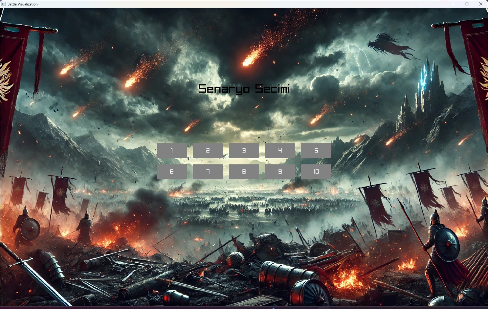
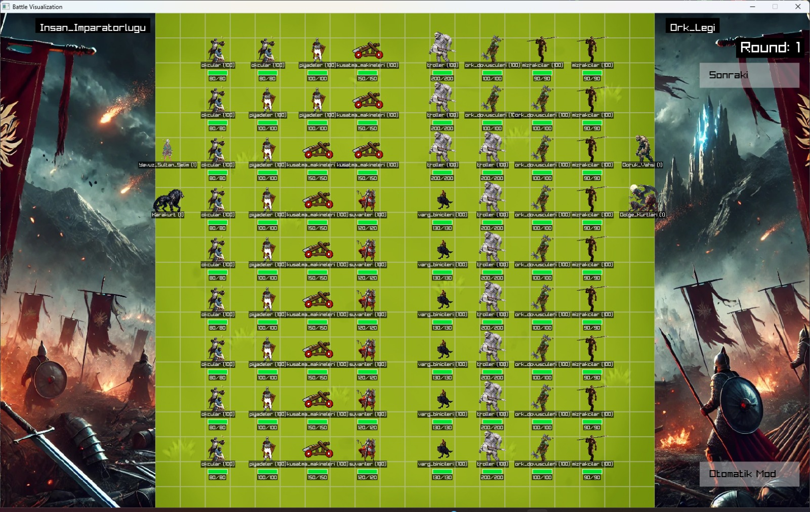
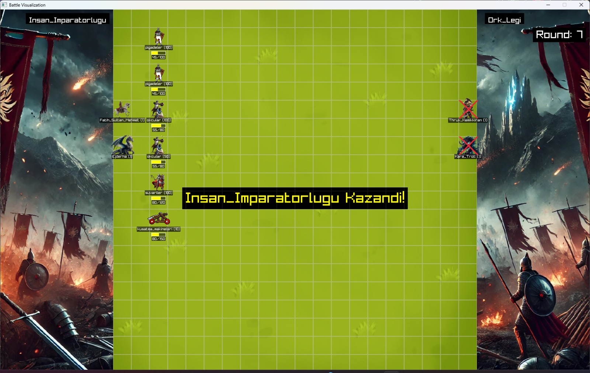

  
  
  

# Strateji Oyunu Simülasyonu

Bu proje, **İnsan İmparatorluğu** ile **Ork Lejyonu** arasında geçen taktiksel savaşları konu alan, ızgara tabanlı bir strateji oyun simülasyonudur. Amacım; oyun dinamiklerini gerçek hayata yakın bir şekilde modelleyerek, sistem tasarımındaki yeteneklerimi ve problem çözme kabiliyetimi sergilemek. Proje, iş başvurularında yaptığım çalışmaları göstermek için hazırlanmış olup, insan kaynaklarının projeyi genel hatlarıyla kavrayabilmesi hedeflenmiştir.

## Proje Özeti

- **Tema:** İki farklı ırkın (İnsan ve Ork) savaş stratejilerinin simülasyonu  
- **Temel İşlev:** 
  - Yerel JSON dosyalarından verilerin manuel olarak işlenmesi (JSON kütüphanesi kullanılmadan)
  - Sunucudan alınan gerçek zamanlı JSON verilerinin CURL kütüphanesi ile işlenmesi
  - 20x20 ızgara tabanlı harita üzerinde birimlerin konumlandırılması ve savaş dinamiklerinin simülasyonu
  - Raylib kütüphanesi ile görselleştirme

Proje, birimlerin saldırı gücü, savunma, kritik vuruş oranı ve sağlık puanları gibi temel özellikleri göz önünde bulundurarak, kahramanlar ve canavarların sağladığı bonuslarla savaşın seyrini etkiliyor.

## Kullanılan Teknolojiler ve Yöntemler

- **Veri İşleme:**  
  - Yerel JSON dosyalarından manuel veri çekimi  
  - Sunucudan gerçek zamanlı veri alımı (CURL kullanılarak)
  
- **Görselleştirme:**  
  - Raylib kütüphanesi ile ızgara tabanlı savaş alanının ve birim hareketlerinin görsel sunumu
  
- **Simülasyon Mekaniği:**  
  - Birimlerin saldırı ve savunma özellikleri, kritik vuruş ve yorgunluk gibi faktörlerin hesaplanması  
  - Savaşın adım adım simülasyonu ve sonuçların hem yazılı hem de grafiksel raporlanması

## Projeden Beklenen Katkılar

- **Yaratıcı Problem Çözme:** Proje, veri işleme ve görselleştirme konularında alternatif yöntemler kullanarak dış kütüphanelere bağımlılığı azaltma yaklaşımını ortaya koyuyor.
- **Takım Çalışması ve Sorumluluk:** Proje, takım arkadaşlarımla birlikte ortaklaşa geliştirdiğimiz bir simülasyon olarak, işbirliği ve proje yönetimi becerilerimi de yansıtıyor.
- **Teknolojik Yetkinlik:** Kullanılan CURL ve Raylib kütüphaneleri sayesinde, gerçek zamanlı veri işleme ve oyun motoru geliştirme konusundaki yeteneklerimi sergilemekteyim.

## Sonuç

Bu simülasyon, strateji oyunları alanında geliştirdiğim uygulamaların ve analiz süreçlerinin özetidir. Proje, iş süreçlerindeki planlama, veri analizi ve görselleştirme gibi önemli becerilerimi ortaya koymaktadır. İlgilenenler için detaylara girmeden, projenin genel yapısı ve kullanılan teknolojiler hakkında fikir vermek amacıyla hazırlanmıştır.

---

*Not: Bu proje, iş başvuruları kapsamında portföy olarak sunulmuştur. Dolayısıyla, kullanıcı kurulumu veya kullanım talimatları yerine, yapılan işin genel hatlarını ve teknolojik altyapısını vurgulamak amaçlanmıştır.*
